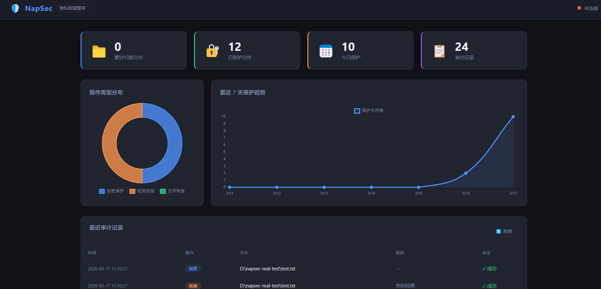

# NapSec — 隐私数据管家

[](https://golang.org)
[](LICENSE)
[]()
[]()
[]()

> 本地优先、零依赖、开箱即用的文件隐私保护工具。  
> **NapSec 2.0 全新升级：支持多种AI大模型智能判断！**
> 本地优先、零依赖、开箱即用的文件隐私保护工具。

---
# NapSec v0.1.0
## 功能特性

| 功能 | 说明                              |
|------|---------------------------------|
| 实时监控 | 基于 fsnotify 监控目录变更              |
| 智能检测 | 内置 10+ 条正则规则，覆盖 API Key、私钥、身份证等 |
| AI增强检测 | **2.0新特性**：支持OpenAI、Azure、Anthropic、Gemini、DeepSeek、Ollama等多种AI模型 |
| AES-256 加密 | PBKDF2 密钥派生 + GCM 认证加密          |
| Git 审计日志 | 所有操作自动 Git commit，可追溯           |
| Web 仪表盘 | 内置可视化面板，无需额外依赖                  |
| 演习模式 | `--dry-run` 只检测不修改文件            |

---

## 快速开始

### 安装

#### 方法1：下载二进制文件（推荐）

从 [Releases](https://github.com/liangach/napsec/releases) 页面下载对应系统的压缩包：

| 系统 | 下载文件 | 说明 |
|------|---------|------|
| Windows 64位 | `napsec-windows-amd64.zip` | Windows 10/11 64位系统 |
| Linux 64位 | `napsec-linux-amd64.tar.gz` | 大多数 Linux 发行版 |
| macOS Intel | `napsec-darwin-amd64.tar.gz` | Intel 芯片的 Mac |
| macOS Apple Silicon | `napsec-darwin-arm64.tar.gz` | M1/M2/M3 芯片的 Mac |

##### Windows 用户安装说明

**方式1：直接使用（简单）**
```bash
# 1. 下载并解压 napsec-windows-amd64.zip
# 2. 重命名为 napsec.exe（可选）
# 3. 在 exe 所在目录打开命令提示符或 PowerShell
.\napsec.exe --help
```

**方式2：添加到环境变量（推荐，可在任意位置使用）**
```bash
# 1. 创建 NapSec 目录
mkdir C:\napsec

# 2. 将 napsec.exe 复制到 C:\napsec 目录

# 3. 添加到系统 PATH（以管理员身份运行 PowerShell）
[Environment]::SetEnvironmentVariable("Path", $env:Path + ";C:\napsec", [EnvironmentVariableTarget]::Machine)

# 4. 重新打开命令行，现在可以在任意位置运行
napsec --help
```

**图形界面添加 PATH 的方法：**
1. 按 `Win + X` → 选择「系统」
2. 点击「高级系统设置」
3. 点击「环境变量」
4. 在「系统变量」中找到 `Path`，双击编辑
5. 点击「新建」，添加 `C:\napsec`
6. 点击「确定」保存所有窗口

##### macOS/Linux 用户安装说明
```bash
# 1. 下载并解压对应系统的压缩包
# 2. 将二进制文件移动到系统 PATH 目录
sudo mv napsec-* /usr/local/bin/napsec

# 3. 添加执行权限
chmod +x /usr/local/bin/napsec

# 4. 现在可以在任意位置运行
napsec --help
```

#### 方法2：从源码编译
```bash
# 克隆仓库
git clone https://github.com/liangach/napsec.git
cd napsec

# 编译
make build

# 编译后的二进制文件在 build/ 目录
./build/napsec --help
```

#### 方法3：使用 Go 安装
```bash
go install github.com/liangach/napsec/cmd/napsec@latest
```

### 基本用法

```bash
# 监控当前目录（演习模式）
napsec start . --dry-run

# 监控指定目录并启用加密保护
napsec start ~/Documents --password mypassword

# 查看状态
napsec status

# 列出已保护文件
napsec list

# 恢复文件
napsec recover ~/.napsec/vault/secret.txt.napsec

# 启动 Web 仪表盘
napsec web --port 8080
```

---

## 项目结构

```
napsec/
├── cmd/napsec/          # CLI 入口
│   └── commands/          # 子命令
├── internal/
│   ├── monitor/           # 文件监控（fsnotify）
│   ├── detector/          # 敏感信息检测（正则引擎）
│   ├── executor/          # 加密执行（AES-256-GCM）
│   ├── audit/             # 审计日志（Git）
│   ├── core/              # 核心引擎 + Web API
│   └── config/            # 配置管理
└── web/                   # Web 仪表盘前端
```

---

## 安全设计

- 所有加密操作使用 **AES-256-GCM**（认证加密）
- 密钥由 **PBKDF2**（100000 次迭代）从主密码派生
- 加密文件存储在独立的**隔离保险箱**目录
- **原始文件**在加密成功后被删除，原位置替换为提示文件
- Web 服务默认只监听 `localhost`，不暴露公网

## 操作指南
# NapSec 操作指南

## 一、基础操作

### 1. 目录监控与敏感文件保护

```bash
# 1.1 基础监控（演习模式，只检测不加密）
napsec start /path/to/monitor --dry-run

# 1.2 生产级监控（启用加密，自动保护敏感文件）
napsec start /path/to/monitor --password your-password

# 1.3 自定义监控配置（指定工作线程数）
napsec start /path/to/monitor \
  --password your-password \
  --workers 8
```

**参数说明：**
- `--password, -p`：加密密码（如不提供，会交互式提示输入）
- `--vault, -v`：加密保险箱路径（默认：~/.napsec/vault）
- `--dry-run, -d`：演习模式，只检测不执行保护操作
- `--workers, -w`：并发线程数（默认：4）

### 2. 加密文件管理

```bash
# 2.1 列出最近保护的加密文件
napsec list
napsec list --limit 50  # 显示最近50条记录（默认20条）

# 2.2 恢复加密文件到指定路径
napsec recover ~/.napsec/vault/secret.txt.napsec --output ~/recovered-secret.txt
```

**参数说明：**
- `list --limit, -n`：显示最近 N 条记录（默认20）
- `recover --output, -o`：恢复到指定路径（默认：~/Desktop/recovered）
- `recover --password, -p`：解密密码（如不提供，会交互式提示输入）

### 3. 审计与状态查看

```bash
# 3.1 查看 NapSec 运行状态
napsec status
```

**状态信息包含：**
- 总保护文件数
- 今日保护文件数
- 最后操作时间
- 审计日志总条数

## 二、Web 仪表盘操作

### 1. 启动 Web 服务

```bash
# 启动 Web 仪表盘（默认端口 8080）
napsec web

# 指定端口启动
napsec web --port 9090

# 开发模式启动
napsec web --dev
```

### 2. 访问 Web 界面

启动后访问：`http://localhost:8080`（或指定端口）

**Web 界面功能：**
- 实时统计看板（通过 `/api/stats` 接口）
- 审计记录列表（通过 `/api/records` 接口）
- 健康检查（通过 `/api/health` 接口）



### 3. Web API 接口

NapSec Web 服务提供以下 REST API：

- `GET /api/stats` - 获取实时统计信息
- `GET /api/records` - 获取最近50条审计记录
- `GET /api/health` - 健康检查

## 三、演习操作

### 1. 演习模式（Dry Run）

适合首次使用时验证规则有效性，仅检测敏感文件不执行加密/删除操作：

```bash
# 基础演习
napsec start /path/to/monitor --dry-run
```

### 2. 后台运行

#### Windows 系统
```bash
# 后台启动（使用 start /b）
start /b napsec start D:\work --password your-password
```

#### Linux/macOS 系统
```bash
# 使用 nohup 后台运行
nohup napsec start ~/work --password your-password > ~/.napsec/napsec.log 2>&1 &
```

## 四、常见问题

### 1. 密码输入问题

如果启动时未提供 `--password` 参数，程序会交互式提示输入：
```bash
napsec start ~/Documents
请输入加密密码：
请再次输入密码：
```

### 2. 停止监控

按 `Ctrl+C` 即可停止正在运行的监控服务。

### 3. 目录权限

NapSec 会自动创建所需目录（`~/.napsec/vault` 和 `~/.napsec/audit`），并设置为 `0700` 权限。

## 五、安全注意事项

1. **密码管理**：
    - 启动监控时输入的密码请妥善保管
    - 恢复文件时需要提供相同的密码
    - 忘记密码将无法恢复已加密文件

2. **加密文件存储**：
    - 加密文件保存在 `~/.napsec/vault` 目录
    - 建议定期备份此目录到安全位置

3. **审计日志**：
    - 所有操作记录在 `~/.napsec/audit` 目录
    - 使用 Git 进行版本管理，可查看操作历史

## 六、命令速查表

| 命令 | 用途 | 示例 |
|------|------|------|
| `napsec start` | 启动监控 | `napsec start ~/Documents -p 123456` |
| `napsec status` | 查看状态 | `napsec status` |
| `napsec list` | 列出记录 | `napsec list -n 50` |
| `napsec recover` | 恢复文件 | `napsec recover ~/.napsec/vault/file.napsec -o ~/file` |
| `napsec web` | 启动Web | `napsec web -p 8080` |
| `napsec --help` | 查看帮助 | `napsec --help` |
| `napsec [命令] --help` | 查看子命令帮助 | `napsec start --help` |

# NapSec v0.2.0 （AI）
## AI 大模型支持

NapSec 2.0 在规则引擎基础上，新增 **AI 增强判断**。规则优先，AI 兜底，实现更精准的敏感文件识别。

### 特性亮点

- 插件化设计，支持多家 AI 提供商
- 规则引擎优先，AI 作为补充判断
- 用户自备 Token，无额外费用
- 智能文件采样，大幅节省 Token 消耗
- 数据隐私安全，仅发送采样内容
- 支持云端 + 本地离线模型

### 支持的 AI 

| 提供商 | 类型 | 默认模型 | 特点 |
|--------|------|----------|------|
| OpenAI | 云端 API | gpt-3.5-turbo | 稳定、快速 |
| Azure OpenAI | 云端 API | gpt-35-turbo | 企业合规、稳定 |
| Anthropic Claude | 云端 API | claude-3-haiku | 安全、理解能力强 |
| Google Gemini | 云端 API | gemini-pro | 免费额度高 |
| DeepSeek | 云端 API | deepseek-chat | 性价比高、中文友好 |
| Ollama | 本地模型 | llama2 | 完全离线、零成本 |

### 工作流程

```
文件事件 → 规则引擎检测
  ├── 匹配 → 直接保护
  └── 不匹配 → 判断 AI 是否启用
            ├── 不启用 → 忽略
            └── 启用 → AI 智能判断
                      ├── 敏感 → 保护文件
                      └── 不敏感 → 忽略
```

---

## AI 配置指南

### 1. OpenAI

```bash
napsec start ~/Documents \
  --password your-password \
  --ai-enabled \
  --ai-provider openai \
  --ai-key sk-your-openai-api-key
```

### 2. Azure OpenAI

```bash
napsec start ~/Documents \
  --password your-password \
  --ai-enabled \
  --ai-provider azure \
  --ai-endpoint https://your-resource.openai.azure.com/openai/deployments/gpt-35-turbo/chat/completions \
  --ai-key your-azure-key \
  --ai-model gpt-35-turbo
```

### 3. Anthropic Claude

```bash
napsec start ~/Documents \
  --password your-password \
  --ai-enabled \
  --ai-provider anthropic \
  --ai-key your-anthropic-key
```

### 4. Google Gemini

```bash
napsec start ~/Documents \
  --password your-password \
  --ai-enabled \
  --ai-provider gemini \
  --ai-key your-gemini-key
```

### 5. DeepSeek

```bash
napsec start ~/Documents \
  --password your-password \
  --ai-enabled \
  --ai-provider deepseek \
  --ai-key your-deepseek-key
```

### 6. Ollama 本地模型

```bash
# 安装 Ollama
curl -fsSL https://ollama.com/install.sh | sh

# 拉取模型
ollama pull llama2
ollama serve

# 使用本地模型
napsec start ~/Documents \
  --password your-password \
  --ai-enabled \
  --ai-provider ollama \
  --ai-endpoint http://localhost:11434/api/generate \
  --ai-model llama2
```

### AI 参数说明

| 参数 | 作用 |
|------|------|
| `--ai-enabled` | 启用 AI |
| `--ai-provider` | 指定 AI 厂商 |
| `--ai-key` | API 密钥 |
| `--ai-endpoint` | 接口地址 |
| `--ai-model` | 模型名称 |
| `--ai-temperature` | 输出随机性 |
| `--ai-sample-lines` | 文件采样行数 |
| `--ai-max-tokens` | 最大 Token |

---
